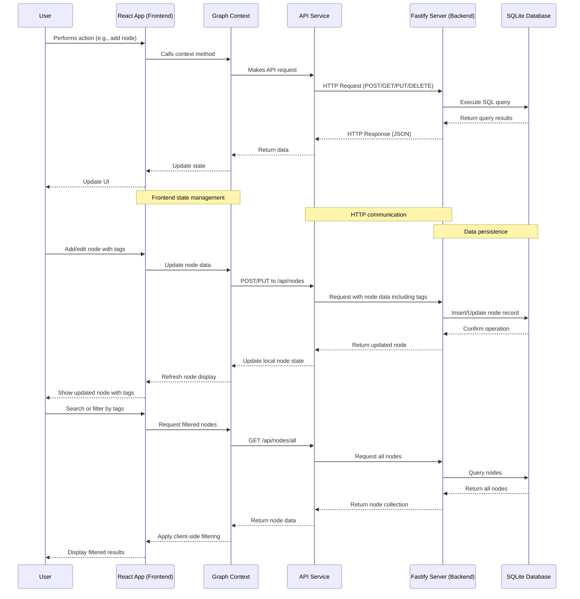

# Task Flow

A full-stack application for visualizing and managing hierarchical task relationships through an interactive graph interface. Task Flow enables project managers to build visual representations of initiatives, epics, tasks, and their dependencies using a flexible node-based approach with customizable node types.

## Demonstration

The demonstration showcases the process of creating a project initiative, followed by the addition of multiple epics and tasks. It includes specifying details and assigning tags to these nodes. Furthermore, it illustrates the creation of a custom node type labeled "spike," visualizing their interrelationships, and subsequently reviewing the implementation within a table view to facilitate efficient searching and filtering.


## Features

- Interactive graph visualization using ReactFlow
- Hierarchical node structure with parent-child relationships
- Custom node types with user-defined colors
- Create, update, delete nodes and their connections
- Navigate through node hierarchies (subgraphs)
- Position persistence across application sessions
- In-memory SQLite database for data storage
- Tagging system for better metadata organization
- Dual-view interface (graph and table views)
- Advanced search and filtering capabilities
- Responsive UI with improved node layout

## Tech Stack

### Frontend

- **React** with TypeScript for the UI framework
- **Vite** for fast development and building
- **ReactFlow** for interactive graph visualization
- **Axios** for API communication
- **Context API** for state management

### Backend

- **Fastify** for high-performance API server
- **TypeScript** for type safety
- **SQLite** (in-memory) for database
- **Knex.js** for database queries and schema management
- **UUID** for generating unique identifiers

## Project Structure

```plaintext
task-flow/
├── frontend/              # React frontend application
│   ├── src/
│   │   ├── components/    # React components
│   │   │   ├── nodes/     # Custom nodes for ReactFlow
│   │   │   │   ├── CustomNode.tsx
│   │   │   │   └── CustomEdge.tsx
│   │   ├── contexts/      # React contexts for state management
│   │   │   └── GraphContext.tsx
│   │   ├── services/      # API services
│   │   │   └── api.ts
│   │   ├── App.tsx        # Main application component
│   │   └── main.tsx       # Entry point
│   └── package.json       # Frontend dependencies
├── backend/               # Fastify backend application
│   ├── src/
│   │   ├── db/            # Database configuration
│   │   │   └── config.ts
│   │   ├── models/        # Data models
│   │   │   └── node.ts
│   │   ├── routes/        # API routes
│   │   │   └── nodeRoutes.ts
│   │   └── index.ts       # Backend entry point
│   └── package.json       # Backend dependencies
└── package.json           # Root package.json for managing both projects
```

## Architecture

### Frontend-Backend Interaction

The diagram below illustrates how the frontend and backend components interact when a user performs actions in the application:



This diagram demonstrates:

- How user actions flow through the application layers
- The separation between frontend and backend components
- How data persists and retrieves from the database
- The role of the Graph Context in state management
- Specific flows for features like tagging and searching

## Getting Started

### Prerequisites

- Node.js
- npm or yarn

### Installation

Clone the repository and install dependencies:

```bash
# Clone the repository
git clone https://github.com/yourusername/task-flow.git
cd task-flow

# Install dependencies for both frontend and backend
npm run install:all
```

### Development

Start both frontend and backend in development mode:

```bash
# Start both frontend and backend
npm run dev

# Start only the backend
npm run dev:backend

# Start only the frontend
npm run dev:frontend
```

### Build

Build both frontend and backend for production:

```bash
npm run build
```

### Running in Production

After building, you can start the application:

```bash
npm start
```

## Usage Guide

### Creating Node Types

1. Click the "Manage Node Types" button in the top-right corner
2. Enter a name and select a color for your new node type
3. Click "Create Type"
4. Your new node type will appear in the list and be available when creating nodes

### Adding Nodes

1. Click the "+ Add Node" button in the top-right corner
2. Select a node type from the dropdown menu
3. Enter a name and optional description for your node
4. Add optional tags to categorize your node
5. Click "Add" to create the node on the graph

### Creating Connections

1. Click and drag from a node's bottom handle (source)
2. Drop onto another node's top handle (target)
3. A connection will be created between the nodes

### Editing Nodes

1. Click to select a node
2. Use the toolbar that appears above the node to:
   - Edit the node's name and description
   - Navigate into the node's subgraph
   - Delete the node and all its connections

### Navigating Hierarchies

1. Select a node and click "Open Subgraph" to navigate into it
2. Use the "Back to Parent" button to navigate up in the hierarchy

### Deleting Connections

1. Hover over a connection to see the delete button
2. Click the delete button and confirm to remove the connection

## License

This project is licensed under the MIT License - see the [LICENSE](LICENSE) file for details.